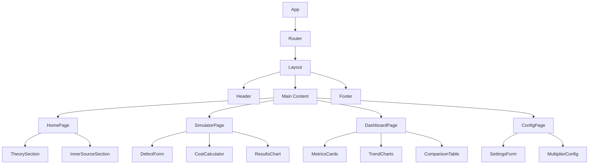

# Componentes da Arquitetura

## Estrutura de Componentes

O Portal Custo Defeito segue uma arquitetura baseada em componentes modulares e reutilizáveis.

## Hierarquia de Componentes



## Componentes Core

### 1. **Layout Components**

#### Header
```typescript
interface HeaderProps {
  title: string;
  navigation: NavigationItem[];
}
```
- Navegação principal
- Branding do Time de Qualidade
- Menu responsivo

#### Footer
```typescript
interface FooterProps {
  version: string;
  links: FooterLink[];
}
```
- Informações de copyright
- Links úteis
- Versão da aplicação

### 2. **Page Components**

#### HomePage
- Apresentação da teoria
- Seção InnerSource
- Links de navegação

#### SimulatorPage
- Formulário de entrada de dados
- Calculadora de custos
- Visualização de resultados

#### DashboardPage
- Métricas consolidadas
- Gráficos de tendências
- Análises comparativas

#### ConfigPage
- Configurações de multiplicadores
- Parâmetros organizacionais
- Preferências do usuário

### 3. **UI Components (shadcn/ui)**

#### Cards
```typescript
interface CardProps {
  title: string;
  description?: string;
  children: React.ReactNode;
  className?: string;
}
```

#### Charts
```typescript
interface ChartProps {
  data: ChartData[];
  type: 'line' | 'bar' | 'pie';
  config: ChartConfig;
}
```

#### Forms
```typescript
interface FormProps {
  schema: ZodSchema;
  onSubmit: (data: FormData) => void;
  defaultValues?: Partial<FormData>;
}
```

## Hooks Customizados

### useDefectCalculation
```typescript
interface UseDefectCalculationReturn {
  calculateCost: (defect: DefectData) => CostResult;
  multipliers: Multipliers;
  updateMultipliers: (multipliers: Partial<Multipliers>) => void;
}
```

### useMobile
```typescript
interface UseMobileReturn {
  isMobile: boolean;
  isTablet: boolean;
  isDesktop: boolean;
}
```

### useToast
```typescript
interface UseToastReturn {
  toast: (message: ToastMessage) => void;
  dismiss: (id: string) => void;
}
```

## Utilitários e Bibliotecas

### defectCalculations.ts
```typescript
export interface DefectData {
  phase: 'development' | 'system-test' | 'acceptance-test' | 'production';
  effort: number;
  hourlyRate: number;
}

export interface CostResult {
  baseCost: number;
  multipliedCost: number;
  multiplier: number;
  savings: number;
}

export const calculateDefectCost = (defect: DefectData): CostResult => {
  // Implementação dos cálculos
};
```

### defaultData.ts
```typescript
export const DEFAULT_MULTIPLIERS = {
  development: 1,
  systemTest: 5,
  acceptanceTest: 10,
  production: 30,
} as const;

export const DEFAULT_HOURLY_RATE = 100;
```

## Padrões de Componentes

### 1. **Composição sobre Herança**
```typescript
// ✅ Bom: Composição
const Card = ({ children, ...props }) => (
  <div className="card" {...props}>
    {children}
  </div>
);

// ❌ Evitar: Herança complexa
class BaseCard extends Component { ... }
```

### 2. **Props Interface**
```typescript
// ✅ Sempre definir interfaces para props
interface ButtonProps {
  variant: 'primary' | 'secondary';
  size: 'sm' | 'md' | 'lg';
  onClick: () => void;
  children: React.ReactNode;
}
```

### 3. **Conditional Rendering**
```typescript
// ✅ Renderização condicional clara
{isLoading ? (
  <Spinner />
) : (
  <Content data={data} />
)}
```

### 4. **Error Boundaries**
```typescript
// Componentes críticos envolvidos em Error Boundaries
<ErrorBoundary fallback={<ErrorFallback />}>
  <CriticalComponent />
</ErrorBoundary>
```

## Testes de Componentes

### Estratégia de Testes
1. **Unit Tests**: Componentes isolados
2. **Integration Tests**: Fluxos completos
3. **Visual Tests**: Snapshots de UI

### Exemplo de Teste
```typescript
describe('DefectCalculator', () => {
  it('should calculate cost correctly', () => {
    render(<DefectCalculator />);
    
    fireEvent.change(screen.getByLabelText('Effort'), {
      target: { value: '10' }
    });
    
    fireEvent.click(screen.getByText('Calculate'));
    
    expect(screen.getByText('Cost: R$ 1.000')).toBeInTheDocument();
  });
});
```

## Performance

### Otimizações Implementadas
1. **React.memo**: Componentes puros
2. **useMemo**: Cálculos custosos
3. **useCallback**: Funções estáveis
4. **Lazy Loading**: Componentes sob demanda

### Exemplo de Otimização
```typescript
const ExpensiveComponent = React.memo(({ data }) => {
  const processedData = useMemo(() => 
    processLargeDataset(data), [data]
  );
  
  return <Chart data={processedData} />;
});
```
