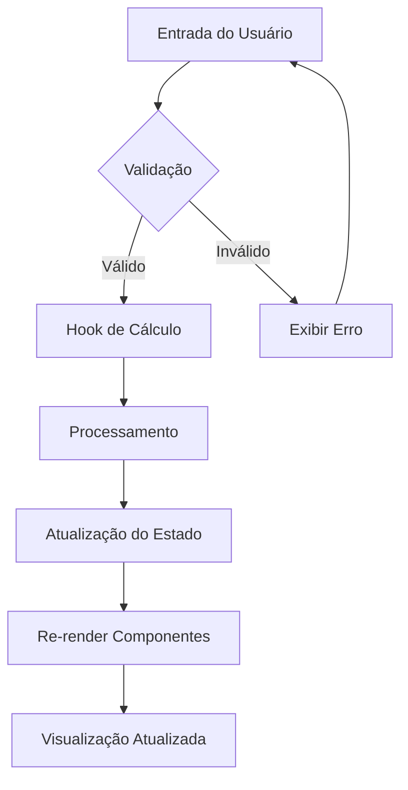
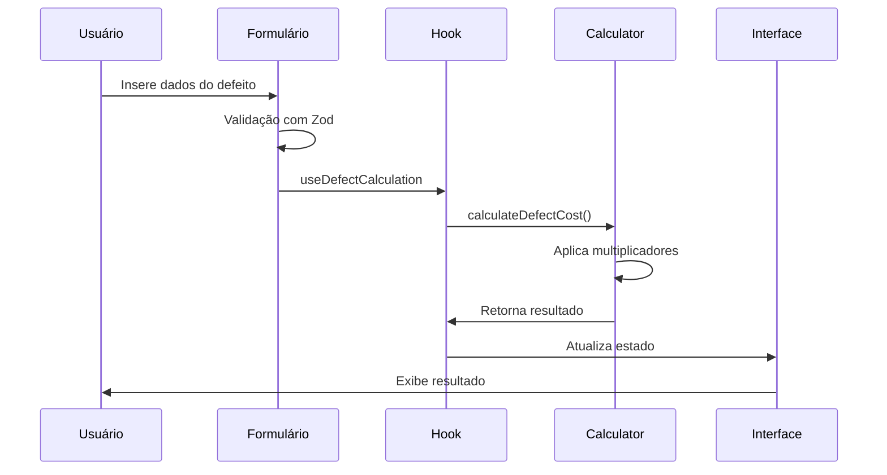
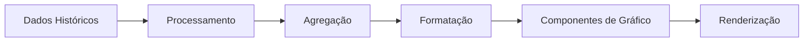

# Fluxo de Dados

## Visão Geral do Fluxo de Dados

O Portal Custo Defeito utiliza um fluxo de dados unidirecional baseado em React hooks e estado local.



## Fluxos Principais

### 1. Simulação de Custos



### 2. Configuração de Multiplicadores

```mermaid
sequenceDiagram
    participant U as Usuário
    participant S as Settings
    parameter L as LocalStorage
    participant H as Hook
    participant UI as Interface
    
    U->>S: Altera multiplicador
    S->>S: Validação
    S->>H: useSettings
    H->>L: Salva configuração
    H->>UI: Atualiza estado global
    UI->>U: Confirma alteração
```

### 3. Visualização de Dashboard



## Gerenciamento de Estado

### Estado Local (useState)
```typescript
// Estado de formulários
const [formData, setFormData] = useState<DefectFormData>({
  phase: 'development',
  effort: 0,
  hourlyRate: DEFAULT_HOURLY_RATE
});

// Estado de resultados
const [results, setResults] = useState<CostResult | null>(null);
```

### Estado Compartilhado (Context)
```typescript
// Configurações globais
const SettingsContext = createContext<SettingsContextType>({
  multipliers: DEFAULT_MULTIPLIERS,
  updateMultipliers: () => {},
  theme: 'light',
  setTheme: () => {}
});
```

### Persistência Local
```typescript
// Hook para persistência
const useLocalStorage = <T>(key: string, defaultValue: T) => {
  const [value, setValue] = useState<T>(() => {
    const stored = localStorage.getItem(key);
    return stored ? JSON.parse(stored) : defaultValue;
  });

  useEffect(() => {
    localStorage.setItem(key, JSON.stringify(value));
  }, [key, value]);

  return [value, setValue] as const;
};
```

## Validação de Dados

### Schema de Validação (Zod)
```typescript
const DefectSchema = z.object({
  phase: z.enum(['development', 'system-test', 'acceptance-test', 'production']),
  effort: z.number().min(0.1).max(1000),
  hourlyRate: z.number().min(1).max(10000),
  description: z.string().optional()
});

type DefectData = z.infer<typeof DefectSchema>;
```

### Validação em Tempo Real
```typescript
const useFormValidation = (schema: ZodSchema) => {
  const [errors, setErrors] = useState<Record<string, string>>({});
  
  const validate = (data: unknown) => {
    const result = schema.safeParse(data);
    if (!result.success) {
      const fieldErrors = result.error.flatten().fieldErrors;
      setErrors(fieldErrors);
      return false;
    }
    setErrors({});
    return true;
  };
  
  return { errors, validate };
};
```

## Cálculos de Negócio

### Algoritmo Principal
```typescript
export const calculateDefectCost = (defect: DefectData): CostResult => {
  const { phase, effort, hourlyRate } = defect;
  
  // Custo base
  const baseCost = effort * hourlyRate;
  
  // Multiplicador baseado na fase
  const multiplier = PHASE_MULTIPLIERS[phase];
  
  // Custo com multiplicador
  const multipliedCost = baseCost * multiplier;
  
  // Economia se corrigido na fase de desenvolvimento
  const developmentCost = baseCost * PHASE_MULTIPLIERS.development;
  const savings = multipliedCost - developmentCost;
  
  return {
    baseCost,
    multipliedCost,
    multiplier,
    savings: Math.max(0, savings)
  };
};
```

### Agregações para Dashboard
```typescript
export const aggregateDefectData = (defects: DefectData[]): AggregatedData => {
  return defects.reduce((acc, defect) => {
    const result = calculateDefectCost(defect);
    
    acc.totalCost += result.multipliedCost;
    acc.totalSavings += result.savings;
    acc.byPhase[defect.phase] = (acc.byPhase[defect.phase] || 0) + 1;
    
    return acc;
  }, {
    totalCost: 0,
    totalSavings: 0,
    byPhase: {} as Record<Phase, number>
  });
};
```

## Tratamento de Erros

### Error Boundaries
```typescript
class ErrorBoundary extends Component<Props, State> {
  constructor(props: Props) {
    super(props);
    this.state = { hasError: false, error: null };
  }

  static getDerivedStateFromError(error: Error): State {
    return { hasError: true, error };
  }

  componentDidCatch(error: Error, errorInfo: ErrorInfo) {
    console.error('Error caught by boundary:', error, errorInfo);
  }

  render() {
    if (this.state.hasError) {
      return <ErrorFallback error={this.state.error} />;
    }

    return this.props.children;
  }
}
```

### Tratamento de Erros Assíncronos
```typescript
const useAsyncError = () => {
  const [error, setError] = useState<Error | null>(null);
  
  const throwError = useCallback((error: Error) => {
    setError(error);
  }, []);
  
  useEffect(() => {
    if (error) {
      throw error;
    }
  }, [error]);
  
  return throwError;
};
```

## Performance e Otimização

### Memoização de Cálculos
```typescript
const useMemoizedCalculation = (defect: DefectData) => {
  return useMemo(() => {
    return calculateDefectCost(defect);
  }, [defect.phase, defect.effort, defect.hourlyRate]);
};
```

### Debounce para Inputs
```typescript
const useDebounce = <T>(value: T, delay: number): T => {
  const [debouncedValue, setDebouncedValue] = useState<T>(value);

  useEffect(() => {
    const handler = setTimeout(() => {
      setDebouncedValue(value);
    }, delay);

    return () => {
      clearTimeout(handler);
    };
  }, [value, delay]);

  return debouncedValue;
};
```

### Lazy Loading de Componentes
```typescript
const LazyDashboard = lazy(() => import('./pages/Dashboard'));
const LazySimulator = lazy(() => import('./pages/Simulator'));

// Uso com Suspense
<Suspense fallback={<Loading />}>
  <LazyDashboard />
</Suspense>
```
