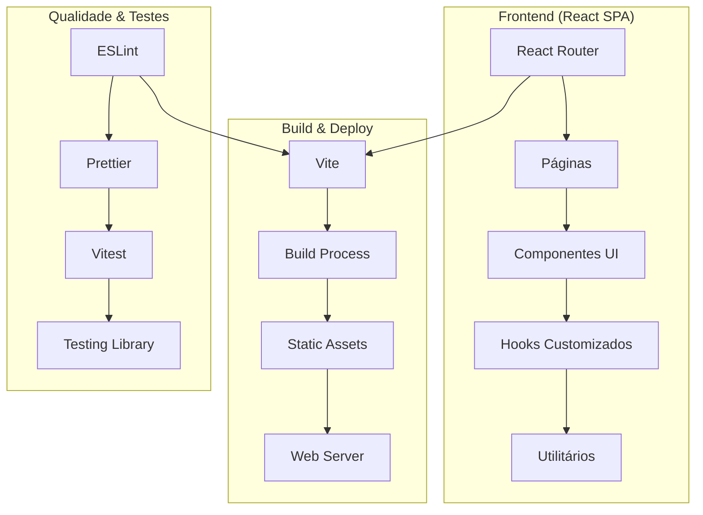
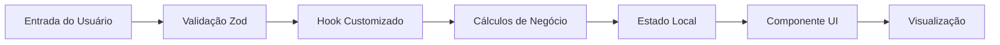

# Arquitetura - Visão Geral

## Arquitetura da Aplicação

O Portal Custo Defeito é uma **Single Page Application (SPA)** construída com tecnologias modernas do ecossistema React.



## Stack Tecnológica

### Core Framework
- **React 18**: Biblioteca principal para construção da interface
- **TypeScript**: Tipagem estática para maior robustez
- **Vite**: Build tool moderna e rápida

### Roteamento e Estado
- **React Router DOM**: Gerenciamento de rotas SPA
- **React Hook Form**: Gerenciamento de formulários
- **Zod**: Validação de schemas

### Interface e Estilização
- **Tailwind CSS**: Framework CSS utility-first
- **shadcn/ui**: Componentes UI baseados em Radix UI
- **Lucide React**: Ícones consistentes
- **Recharts**: Biblioteca de gráficos

### Qualidade e Testes
- **ESLint**: Linting de código
- **Prettier**: Formatação automática
- **Vitest**: Framework de testes
- **Testing Library**: Utilitários para testes de componentes

## Princípios Arquiteturais

### 1. **Componentização**
- Componentes reutilizáveis e modulares
- Separação clara de responsabilidades
- Props tipadas com TypeScript

### 2. **Hooks Pattern**
- Lógica de negócio encapsulada em hooks customizados
- Reutilização de código entre componentes
- Testabilidade isolada

### 3. **Type Safety**
- TypeScript em todo o codebase
- Validação de dados com Zod
- Interfaces bem definidas

### 4. **Performance**
- Lazy loading de componentes
- Otimizações do Vite
- Bundle splitting automático

### 5. **Acessibilidade**
- Componentes acessíveis do Radix UI
- Semântica HTML adequada
- Suporte a navegação por teclado

## Estrutura de Diretórios

```
src/
├── components/          # Componentes reutilizáveis
│   ├── cards/          # Componentes de cartões
│   ├── charts/         # Componentes de gráficos
│   ├── layout/         # Componentes de layout
│   └── ui/             # Componentes base do shadcn/ui
├── hooks/              # Hooks customizados
├── lib/                # Utilitários e configurações
├── pages/              # Páginas da aplicação
└── types/              # Definições de tipos TypeScript
```

## Fluxo de Dados



## Deployment

### Build Process
1. **Desenvolvimento**: `npm run dev` - Servidor de desenvolvimento Vite
2. **Build**: `npm run build` - Geração de assets otimizados
3. **Preview**: `npm run preview` - Preview local do build

### CI/CD Pipeline
- **Lint**: Verificação de qualidade de código
- **Audit**: Verificação de vulnerabilidades
- **Build**: Geração de artefatos de produção
- **Deploy**: Publicação automática

## Considerações de Segurança

### Frontend Security
- **Content Security Policy**: Configurado no servidor web
- **HTTPS**: Comunicação criptografada
- **Dependency Scanning**: Verificação automática de vulnerabilidades
- **Input Validation**: Validação rigorosa com Zod

### Code Quality
- **ESLint Rules**: Regras rigorosas de qualidade
- **TypeScript Strict Mode**: Verificações de tipo rigorosas
- **Automated Testing**: Cobertura de testes automatizados
