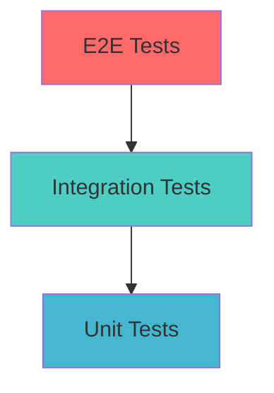

# Estratégia de Testes

## Visão Geral

O Portal Custo Defeito implementa uma estratégia abrangente de testes para garantir qualidade, confiabilidade e manutenibilidade do código.

## Pirâmide de Testes



### Distribuição de Testes
- **70% Unit Tests**: Testes rápidos e isolados
- **20% Integration Tests**: Testes de integração entre componentes
- **10% E2E Tests**: Testes de fluxos completos

## Stack de Testes

### Ferramentas Principais
- **Vitest**: Framework de testes (substituto do Jest)
- **Testing Library**: Utilitários para testes de componentes React
- **jsdom**: Ambiente DOM para testes
- **MSW**: Mock Service Worker para APIs

### Configuração
```typescript
// vitest.config.ts
export default defineConfig({
  plugins: [react()],
  test: {
    globals: true,
    environment: 'jsdom',
    setupFiles: ['./src/__tests__/setup.ts'],
    coverage: {
      reporter: ['text', 'json', 'html'],
      exclude: [
        'node_modules/',
        'src/__tests__/',
        '**/*.d.ts',
        '**/*.config.*'
      ]
    }
  }
});
```

## Unit Tests

### Testando Componentes
```typescript
// components/__tests__/MetricCard.test.tsx
import { render, screen } from '@testing-library/react';
import { MetricCard } from '../MetricCard';

describe('MetricCard', () => {
  it('should render title and value correctly', () => {
    render(
      <MetricCard 
        title="Total Cost" 
        value={1000} 
        format="currency" 
      />
    );
    
    expect(screen.getByText('Total Cost')).toBeInTheDocument();
    expect(screen.getByText('R$ 1.000,00')).toBeInTheDocument();
  });

  it('should display trend indicator when provided', () => {
    render(
      <MetricCard 
        title="Savings" 
        value={500} 
        trend="up" 
      />
    );
    
    expect(screen.getByTestId('trend-up')).toBeInTheDocument();
  });

  it('should apply custom className', () => {
    const { container } = render(
      <MetricCard 
        title="Test" 
        value={100} 
        className="custom-class" 
      />
    );
    
    expect(container.firstChild).toHaveClass('custom-class');
  });
});
```

### Testando Hooks
```typescript
// hooks/__tests__/use-defect-calculation.test.ts
import { renderHook, act } from '@testing-library/react';
import { useDefectCalculation } from '../use-defect-calculation';

describe('useDefectCalculation', () => {
  it('should calculate cost correctly', () => {
    const { result } = renderHook(() => useDefectCalculation());
    
    const defect = {
      phase: 'production' as const,
      effort: 10,
      hourlyRate: 100
    };
    
    const cost = result.current.calculateCost(defect);
    
    expect(cost.baseCost).toBe(1000);
    expect(cost.multipliedCost).toBe(30000);
    expect(cost.multiplier).toBe(30);
    expect(cost.savings).toBe(29000);
  });

  it('should update multipliers correctly', () => {
    const { result } = renderHook(() => useDefectCalculation());
    
    act(() => {
      result.current.updateMultipliers({ production: 50 });
    });
    
    expect(result.current.multipliers.production).toBe(50);
  });
});
```

### Testando Utilitários
```typescript
// lib/__tests__/defectCalculations.test.ts
import { calculateDefectCost } from '../defectCalculations';
import { DEFAULT_MULTIPLIERS } from '../defaultData';

describe('defectCalculations', () => {
  describe('calculateDefectCost', () => {
    it('should calculate development phase cost correctly', () => {
      const defect = {
        phase: 'development' as const,
        effort: 5,
        hourlyRate: 80
      };
      
      const result = calculateDefectCost(defect, DEFAULT_MULTIPLIERS);
      
      expect(result.baseCost).toBe(400);
      expect(result.multipliedCost).toBe(400);
      expect(result.multiplier).toBe(1);
      expect(result.savings).toBe(0);
    });

    it('should calculate production phase cost correctly', () => {
      const defect = {
        phase: 'production' as const,
        effort: 2,
        hourlyRate: 150
      };
      
      const result = calculateDefectCost(defect, DEFAULT_MULTIPLIERS);
      
      expect(result.baseCost).toBe(300);
      expect(result.multipliedCost).toBe(9000);
      expect(result.multiplier).toBe(30);
      expect(result.savings).toBe(8700);
    });

    it('should handle zero effort', () => {
      const defect = {
        phase: 'system-test' as const,
        effort: 0,
        hourlyRate: 100
      };
      
      const result = calculateDefectCost(defect, DEFAULT_MULTIPLIERS);
      
      expect(result.baseCost).toBe(0);
      expect(result.multipliedCost).toBe(0);
      expect(result.savings).toBe(0);
    });
  });
});
```

## Integration Tests

### Testando Fluxos Completos
```typescript
// __tests__/SimulatorFlow.test.tsx
import { render, screen, fireEvent, waitFor } from '@testing-library/react';
import userEvent from '@testing-library/user-event';
import { SimulatorPage } from '../pages/SimulatorPage';

describe('Simulator Flow', () => {
  it('should complete defect calculation flow', async () => {
    const user = userEvent.setup();
    render(<SimulatorPage />);
    
    // Preencher formulário
    await user.selectOptions(
      screen.getByLabelText('Phase'),
      'production'
    );
    
    await user.type(
      screen.getByLabelText('Effort (hours)'),
      '10'
    );
    
    await user.type(
      screen.getByLabelText('Hourly Rate'),
      '100'
    );
    
    // Submeter formulário
    await user.click(screen.getByText('Calculate Cost'));
    
    // Verificar resultado
    await waitFor(() => {
      expect(screen.getByText('R$ 30.000,00')).toBeInTheDocument();
      expect(screen.getByText('Savings: R$ 29.000,00')).toBeInTheDocument();
    });
  });

  it('should show validation errors for invalid input', async () => {
    const user = userEvent.setup();
    render(<SimulatorPage />);
    
    // Tentar submeter sem preencher
    await user.click(screen.getByText('Calculate Cost'));
    
    await waitFor(() => {
      expect(screen.getByText('Effort is required')).toBeInTheDocument();
    });
  });
});
```

### Testando Integração com LocalStorage
```typescript
// __tests__/SettingsIntegration.test.tsx
describe('Settings Integration', () => {
  beforeEach(() => {
    localStorage.clear();
  });

  it('should persist multiplier changes', async () => {
    const user = userEvent.setup();
    render(<ConfigPage />);
    
    // Alterar multiplicador
    const productionInput = screen.getByLabelText('Production Multiplier');
    await user.clear(productionInput);
    await user.type(productionInput, '50');
    
    await user.click(screen.getByText('Save Settings'));
    
    // Verificar persistência
    expect(localStorage.getItem('multipliers')).toContain('"production":50');
    
    // Re-renderizar e verificar se mantém o valor
    render(<ConfigPage />);
    expect(screen.getByDisplayValue('50')).toBeInTheDocument();
  });
});
```

## Mocking

### Mock de Hooks
```typescript
// __tests__/mocks/hooks.ts
import { vi } from 'vitest';

export const mockUseDefectCalculation = {
  calculateCost: vi.fn(),
  multipliers: {
    development: 1,
    systemTest: 5,
    acceptanceTest: 10,
    production: 30
  },
  updateMultipliers: vi.fn(),
  isCalculating: false
};

// Uso no teste
vi.mock('@/hooks/use-defect-calculation', () => ({
  useDefectCalculation: () => mockUseDefectCalculation
}));
```

### Mock de APIs (MSW)
```typescript
// __tests__/mocks/handlers.ts
import { rest } from 'msw';

export const handlers = [
  rest.get('/api/defects', (req, res, ctx) => {
    return res(
      ctx.json([
        {
          id: '1',
          phase: 'production',
          effort: 10,
          hourlyRate: 100,
          description: 'Critical bug'
        }
      ])
    );
  }),

  rest.post('/api/defects', (req, res, ctx) => {
    return res(
      ctx.status(201),
      ctx.json({ id: '2', ...req.body })
    );
  })
];

// __tests__/mocks/server.ts
import { setupServer } from 'msw/node';
import { handlers } from './handlers';

export const server = setupServer(...handlers);
```

## Test Utilities

### Custom Render
```typescript
// __tests__/utils/test-utils.tsx
import { render, RenderOptions } from '@testing-library/react';
import { ReactElement } from 'react';
import { BrowserRouter } from 'react-router-dom';
import { SettingsProvider } from '@/contexts/SettingsContext';

const AllTheProviders = ({ children }: { children: React.ReactNode }) => {
  return (
    <BrowserRouter>
      <SettingsProvider>
        {children}
      </SettingsProvider>
    </BrowserRouter>
  );
};

const customRender = (
  ui: ReactElement,
  options?: Omit<RenderOptions, 'wrapper'>
) => render(ui, { wrapper: AllTheProviders, ...options });

export * from '@testing-library/react';
export { customRender as render };
```

### Test Data Factories
```typescript
// __tests__/utils/factories.ts
export const createDefectData = (overrides?: Partial<DefectData>): DefectData => ({
  id: '1',
  phase: 'development',
  effort: 5,
  hourlyRate: 100,
  description: 'Test defect',
  createdAt: new Date(),
  ...overrides
});

export const createCostResult = (overrides?: Partial<CostResult>): CostResult => ({
  baseCost: 500,
  multipliedCost: 500,
  multiplier: 1,
  savings: 0,
  ...overrides
});
```

## Coverage Requirements

### Configuração de Coverage
```typescript
// vitest.config.ts
export default defineConfig({
  test: {
    coverage: {
      thresholds: {
        global: {
          branches: 80,
          functions: 80,
          lines: 80,
          statements: 80
        }
      },
      include: ['src/**/*.{ts,tsx}'],
      exclude: [
        'src/**/*.d.ts',
        'src/**/*.stories.tsx',
        'src/**/*.test.{ts,tsx}',
        'src/main.tsx'
      ]
    }
  }
});
```

### Relatórios de Coverage
```bash
# Gerar relatório de coverage
npm run test:coverage

# Visualizar relatório HTML
open coverage/index.html
```

## Scripts de Teste

### Package.json Scripts
```json
{
  "scripts": {
    "test": "vitest",
    "test:watch": "vitest --watch",
    "test:coverage": "vitest --coverage",
    "test:ui": "vitest --ui",
    "test:run": "vitest run"
  }
}
```

### CI/CD Integration
```yaml
# .gitlab-ci.yml
test:
  stage: test
  script:
    - npm ci
    - npm run test:coverage
  coverage: '/All files[^|]*\|[^|]*\s+([\d\.]+)/'
  artifacts:
    reports:
      coverage_report:
        coverage_format: cobertura
        path: coverage/cobertura-coverage.xml
```

## Debugging Tests

### VS Code Configuration
```json
// .vscode/launch.json
{
  "version": "0.2.0",
  "configurations": [
    {
      "name": "Debug Tests",
      "type": "node",
      "request": "launch",
      "program": "${workspaceFolder}/node_modules/vitest/vitest.mjs",
      "args": ["run", "--reporter=verbose"],
      "console": "integratedTerminal",
      "internalConsoleOptions": "neverOpen"
    }
  ]
}
```

### Debug Utilities
```typescript
// __tests__/utils/debug.ts
import { screen } from '@testing-library/react';

export const debugComponent = () => {
  screen.debug(); // Imprime DOM atual
};

export const logTestData = (data: unknown) => {
  console.log('Test Data:', JSON.stringify(data, null, 2));
};
```

## Best Practices

### Princípios de Teste
1. **AAA Pattern**: Arrange, Act, Assert
2. **Single Responsibility**: Um teste, uma responsabilidade
3. **Descriptive Names**: Nomes claros e descritivos
4. **Independent Tests**: Testes independentes entre si
5. **Fast Execution**: Testes rápidos e eficientes

### Exemplo de Teste Bem Estruturado
```typescript
describe('DefectCalculator', () => {
  describe('when calculating production phase defect', () => {
    it('should return correct cost with 30x multiplier', () => {
      // Arrange
      const defect = createDefectData({
        phase: 'production',
        effort: 10,
        hourlyRate: 100
      });
      
      // Act
      const result = calculateDefectCost(defect, DEFAULT_MULTIPLIERS);
      
      // Assert
      expect(result).toEqual({
        baseCost: 1000,
        multipliedCost: 30000,
        multiplier: 30,
        savings: 29000
      });
    });
  });
});
```

Esta estratégia de testes garante:
- **Confiabilidade**: Detecção precoce de bugs
- **Documentação**: Testes como documentação viva
- **Refatoração Segura**: Mudanças com confiança
- **Qualidade**: Código testado e validado
