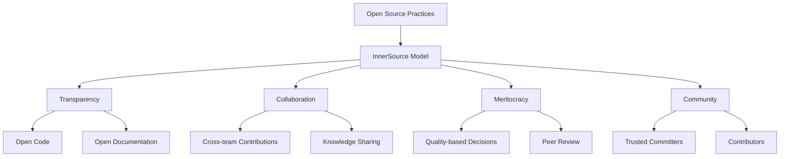
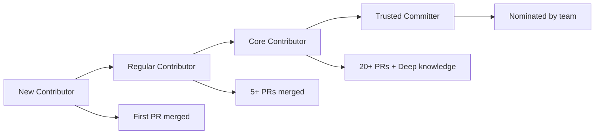
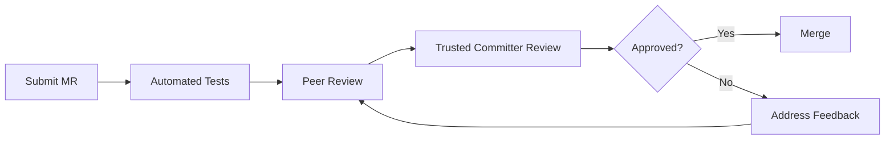

# InnerSource

## O que é InnerSource?

**InnerSource** é a aplicação de práticas e princípios de código aberto dentro dos limites de uma organização. No Portal Custo Defeito, adotamos este modelo para promover colaboração, transparência e inovação entre as diferentes equipes da Softplan.



## Princípios do InnerSource

### 1. **Transparência**
- **Código Aberto**: Todo o código está disponível para visualização
- **Documentação Pública**: Processos e decisões documentados
- **Comunicação Aberta**: Discussões públicas em issues e MRs
- **Métricas Visíveis**: Performance e qualidade transparentes

### 2. **Colaboração**
- **Contribuições Cross-team**: Equipes de diferentes verticais podem contribuir
- **Compartilhamento de Conhecimento**: Aprendizado mútuo entre colaboradores
- **Revisão por Pares**: Qualidade garantida através de code review
- **Mentoria**: Trusted Committers orientam novos contribuidores

### 3. **Meritocracia**
- **Decisões Baseadas em Qualidade**: Melhores ideias prevalecem
- **Reconhecimento por Contribuição**: Mérito baseado em valor agregado
- **Evolução Natural**: Contribuidores podem se tornar Trusted Committers
- **Feedback Construtivo**: Crescimento através de revisões honestas

### 4. **Comunidade**
- **Senso de Propriedade Compartilhada**: Todos são donos do projeto
- **Cultura de Ajuda**: Colaboradores se ajudam mutuamente
- **Diversidade de Perspectivas**: Diferentes backgrounds enriquecem o projeto
- **Sustentabilidade**: Comunidade mantém o projeto a longo prazo

## Estrutura Organizacional

### Trusted Committers

Os **Trusted Committers** são os guardiões do projeto, responsáveis por:

#### 👥 **Equipe Atual**
- **Flávia Cristina da Costa** - Líder Técnica do Time de Qualidade
- **Humberto Zilio** - Arquiteto de Software

#### 🎯 **Responsabilidades**
- **Orientação Técnica**: Definir arquitetura e padrões
- **Mentoria**: Ajudar novos contribuidores
- **Qualidade**: Garantir padrões de código e testes
- **Roadmap**: Definir direção do produto
- **Comunidade**: Fomentar cultura colaborativa

#### 🔧 **Atividades Diárias**
- Revisar merge requests
- Responder issues e dúvidas
- Orientar implementações complexas
- Manter documentação atualizada
- Facilitar discussões técnicas

### Contributors

Os **Contributors** são todos que contribuem para o projeto:

#### 🌟 **Tipos de Contribuição**
- **Código**: Funcionalidades, correções, melhorias
- **Documentação**: Guias, tutoriais, exemplos
- **Testes**: Cobertura, qualidade, automação
- **Design**: UX/UI, acessibilidade, usabilidade
- **Feedback**: Issues, sugestões, validações

#### 📈 **Evolução do Contribuidor**


## Benefícios do InnerSource

### Para a Organização

#### 🚀 **Inovação Acelerada**
- Múltiplas perspectivas geram soluções criativas
- Reutilização de código entre projetos
- Padronização de práticas e ferramentas
- Redução de duplicação de esforços

#### 📚 **Compartilhamento de Conhecimento**
- Desenvolvedores aprendem novas tecnologias
- Práticas de qualidade se espalham
- Mentoria natural entre equipes
- Documentação como fonte de aprendizado

#### 🔧 **Qualidade Melhorada**
- Revisão por múltiplas equipes
- Testes mais abrangentes
- Padrões de código elevados
- Detecção precoce de problemas

### Para os Contribuidores

#### 🎓 **Desenvolvimento Profissional**
- Exposição a diferentes tecnologias
- Aprendizado de boas práticas
- Networking interno
- Reconhecimento por contribuições

#### 💡 **Satisfação no Trabalho**
- Autonomia para melhorar ferramentas
- Impacto visível no trabalho
- Colaboração significativa
- Crescimento técnico contínuo

### Para o Projeto

#### 🏗️ **Sustentabilidade**
- Múltiplos mantenedores
- Conhecimento distribuído
- Evolução contínua
- Resiliência a mudanças de equipe

#### 📊 **Qualidade Superior**
- Mais olhos identificam bugs
- Diversidade de casos de uso
- Testes em diferentes cenários
- Feedback constante de usuários

## Como Participar

### 1. **Primeiros Passos**

#### Para Novos Contribuidores
```bash
# 1. Clone o repositório
git clone https://gitlab.com/softplan/justica/procuradorias/arquitetura-de-software/tools/portal-custo-defeito.git

# 2. Configure o ambiente
cd portal-custo-defeito
npm install

# 3. Execute localmente
npm run dev

# 4. Execute os testes
npm test
```

#### Leia a Documentação
- [Guia de Contribuição](contributing.md)
- [Estrutura do Projeto](development/project-structure.md)
- [Padrões de Código](development/coding-standards.md)

### 2. **Encontre Formas de Contribuir**

#### 🔍 **Issues para Iniciantes**
Procure por labels:
- `good first issue`: Ideal para primeiras contribuições
- `help wanted`: Ajuda necessária da comunidade
- `documentation`: Melhorias na documentação
- `bug`: Correções de problemas

#### 💡 **Ideias de Contribuição**
- Melhorar mensagens de erro
- Adicionar testes unitários
- Otimizar performance
- Melhorar acessibilidade
- Traduzir documentação
- Criar exemplos de uso

### 3. **Processo de Contribuição**

#### 📝 **Fluxo Padrão**
1. **Discussão**: Comente na issue ou crie uma nova
2. **Implementação**: Desenvolva seguindo os padrões
3. **Testes**: Adicione/atualize testes necessários
4. **Documentação**: Atualize docs se necessário
5. **Review**: Submeta MR para revisão
6. **Iteração**: Incorpore feedback dos reviewers
7. **Merge**: Trusted Committer aprova e faz merge

#### 🔄 **Ciclo de Feedback**


## Ferramentas e Recursos

### 🛠️ **Plataformas**
- **GitLab**: Repositório principal e CI/CD
- **Backstage**: Documentação e catálogo de serviços
- **Slack**: Comunicação rápida (canal #portal-custo-defeito)
- **Email**: Comunicação formal com Trusted Committers

### 📊 **Métricas e Transparência**
- **Pipeline Status**: Visível para todos
- **Code Coverage**: Relatórios públicos
- **Performance**: Métricas de aplicação
- **Contributors**: Lista de colaboradores

### 📚 **Documentação**
- **README**: Visão geral e quick start
- **CONTRIBUTING**: Guia detalhado de contribuição
- **Architecture Docs**: Documentação técnica completa
- **API Docs**: Referência de APIs e componentes

## Casos de Sucesso

### 🎯 **Contribuições Significativas**

#### Melhoria de Performance
> "A equipe de Frontend da Vertical Criminal contribuiu com otimizações que reduziram o tempo de carregamento em 40%"

#### Nova Funcionalidade
> "Desenvolvedores da Vertical Trabalhista adicionaram suporte a múltiplas moedas, beneficiando toda a organização"

#### Qualidade de Código
> "A equipe de QA implementou testes E2E que aumentaram a confiabilidade dos deploys"

### 📈 **Métricas de Sucesso**
- **20+ Contributors** de 8 verticais diferentes
- **150+ Pull Requests** merged
- **95% Code Coverage** mantido
- **Zero Critical Bugs** em produção nos últimos 6 meses

## Roadmap InnerSource

### 🎯 **Objetivos 2024**
- [ ] Expandir para 50+ contributors ativos
- [ ] Implementar programa de mentoria formal
- [ ] Criar workshops mensais de InnerSource
- [ ] Desenvolver métricas de saúde da comunidade

### 🚀 **Iniciativas Futuras**
- **InnerSource Guild**: Comunidade de prática
- **Contribution Rewards**: Sistema de reconhecimento
- **Cross-project Collaboration**: Padrões entre projetos
- **InnerSource Metrics**: Dashboard de saúde da comunidade

## Recursos Adicionais

### 📖 **Leitura Recomendada**
- [InnerSource Commons](https://innersourcecommons.org/)
- [Getting Started with InnerSource](https://innersourcecommons.org/learn/books/getting-started-with-innersource/)
- [InnerSource Patterns](https://patterns.innersourcecommons.org/)

### 🎥 **Vídeos e Talks**
- [InnerSource at Scale](https://www.youtube.com/watch?v=example)
- [Building InnerSource Communities](https://www.youtube.com/watch?v=example)

### 🤝 **Comunidades**
- [InnerSource Commons Slack](https://innersourcecommons.org/slack)
- [GitHub InnerSource](https://github.com/topics/innersource)

---

## Junte-se à Nossa Comunidade!

O Portal Custo Defeito é mais que uma ferramenta - é uma comunidade de profissionais apaixonados por qualidade de software. Sua contribuição, independente do tamanho, faz diferença.

### 🚀 **Comece Hoje**
1. Explore o [repositório](https://gitlab.com/softplan/justica/procuradorias/arquitetura-de-software/tools/portal-custo-defeito)
2. Leia o [guia de contribuição](contributing.md)
3. Encontre uma [issue para iniciantes](https://gitlab.com/softplan/justica/procuradorias/arquitetura-de-software/tools/portal-custo-defeito/-/issues?label_name%5B%5D=good%20first%20issue)
4. Faça sua primeira contribuição!

**Juntos, construímos software de qualidade superior! 🌟**
